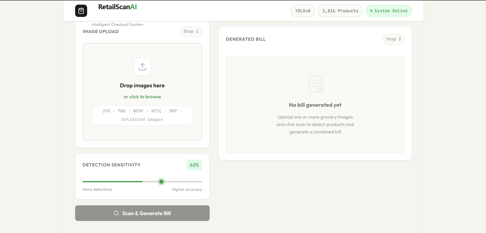
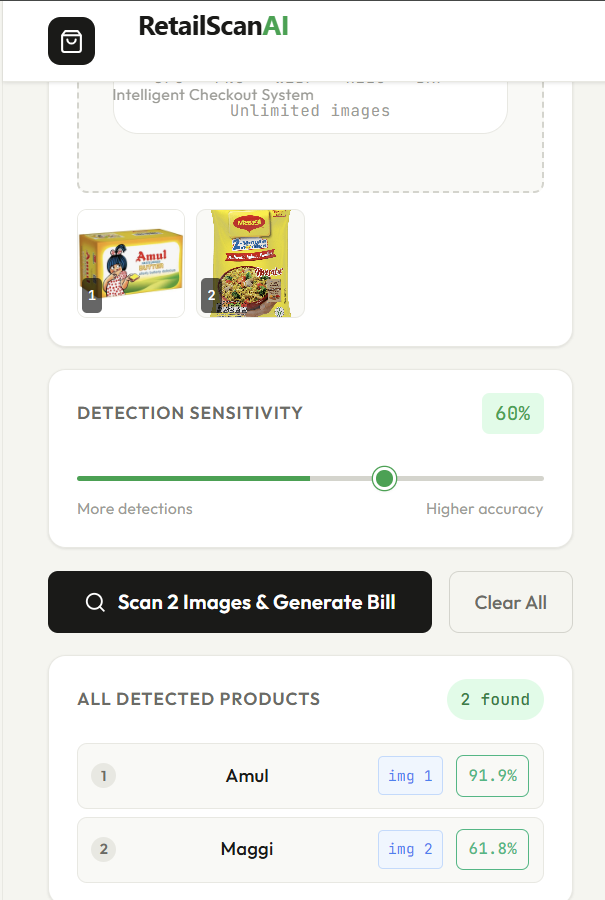
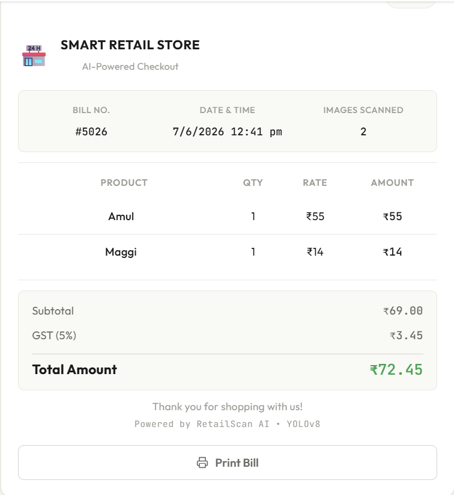
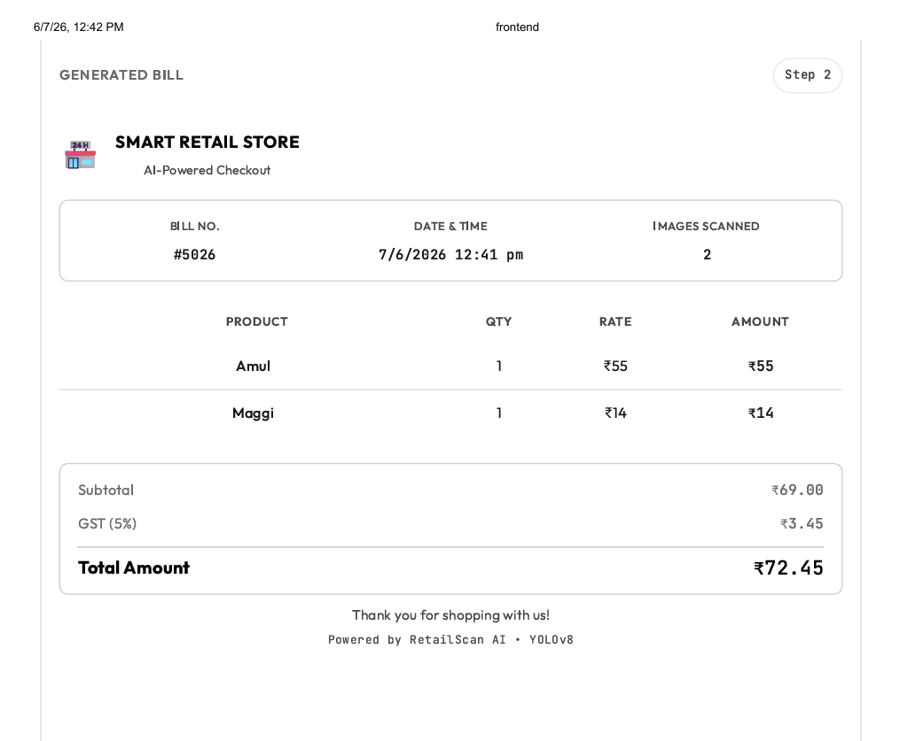

# 🛒 Smart Retail Checkout System

An AI-powered Smart Retail Checkout System that automatically detects grocery products from uploaded images using YOLO and generates bills instantly, reducing checkout time and minimizing manual effort.

---

## 🚀 Project Overview

Traditional retail billing requires manual scanning of each product, resulting in long queues and increased human effort.

This project leverages Computer Vision and Deep Learning to automatically identify products from images and generate a bill, providing a faster and smarter checkout experience.

---

## ✨ Features

- 🔍 Automatic grocery item detection using YOLO
- 📸 Support for multiple image uploads
- 🧾 Automatic bill generation
- 💰 Price calculation for detected products
- ⚡ FastAPI backend for fast inference
- 🎨 Modern React frontend
- 📊 Adjustable confidence threshold
- 🛍️ Combined billing from multiple images
- 📱 Responsive user interface

---

## 🛠️ Tech Stack

### Backend

- Python
- FastAPI
- Ultralytics YOLO
- OpenCV
- NumPy

### Frontend

- React
- Vite
- JavaScript
- CSS

---

## 📂 Project Structure

```text
SmartRetailCheckout/

├── backend/
│   ├── main.py
│   ├── prices.py
│   └── requirements.txt
│
├── frontend/
│   ├── src/
│   ├── public/
│   ├── package.json
│   └── vite.config.js
│
├── .gitignore
└── README.md
```

---

## ⚙️ Installation

### Clone the repository

```bash
git clone https://github.com/hitesh-2005/Smart_Retail_Checkout_System.git
```

### Backend Setup

```bash
cd backend

python -m venv venv

venv\Scripts\activate

pip install -r requirements.txt

uvicorn main:app --reload
```

### Frontend Setup

```bash
cd frontend

npm install

npm run dev
```

---

## 🎯 How It Works

1. Upload one or more grocery images.
2. The YOLO model detects products.
3. Detected products are matched with their prices.
4. A bill is generated automatically.
5. The total amount is calculated and displayed.

---

## 📸 Screenshots

### 🏠 Home Page



---

### 🔍 Product Detection



---

### 🧾 Generated Bill



---

### 📄 PDF Bill



---

## 🔮 Future Enhancements

- 📷 Real-time webcam checkout
- 🏷️ Barcode and QR code integration
- 📄 PDF bill generation
- ☁️ Cloud deployment
- 📦 Inventory management
- 💳 Online payment gateway integration
- 📊 Sales analytics dashboard
- 🤖 Improved model accuracy with larger datasets

---

## 🎓 Learning Outcomes

- Object Detection using YOLO
- FastAPI backend development
- React frontend development
- REST API integration
- Image processing techniques
- Full-stack AI application development

---

## 👨‍💻 Author

**Hitesh Gupta**

Machine Learning & AI Enthusiast

---
